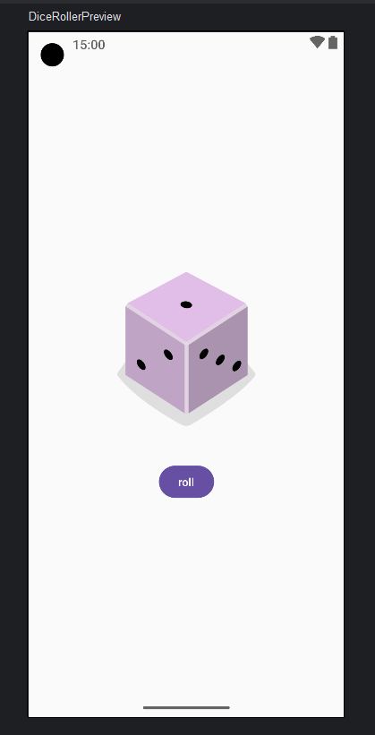

# 🎲 Dice Roller App

This is a simple **Dice Roller** app built using **Jetpack Compose**, developed as part of the [Android Basics with Compose](https://developer.android.com/courses/android-basics-compose) course.

---

## 📜 Overview
The app lets users **roll a dice** with a single tap, generating a random number between **1 and 6**. It helps learners understand fundamental **UI concepts**, **state management**, and **click interactions** in Jetpack Compose.

---

## 🚀 Features
- 🎲 Random dice rolling functionality
- 📱 Fully declarative UI using **Jetpack Compose**
- 🔄 Stateful UI handling using `remember`
- 🎨 **Material Design 3** elements for styling
- 🖼️ Dice images dynamically updating based on roll result

---

## 🛠️ Tech Stack
- **Kotlin** 🧑‍💻
- **Jetpack Compose** 💡
- **State Management** (`remember`, `mutableStateOf`) ⚡
- **Android Studio** 🏗️

### 📷 App Screenshot

